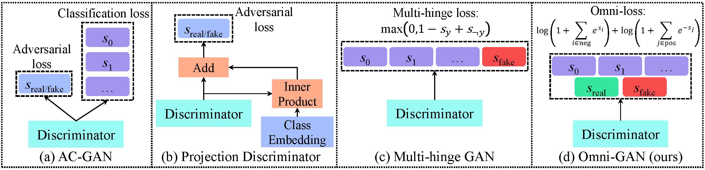

## Omni-GAN

### Comparision of several cGANs



#### Results on CIFAR100
<p float="left">


</p>


### Prepare environment


```bash
cd Omni-GAN-PyTorch
conda create -y --name omnigan python=3.6.7 
conda activate omnigan
pip install torch==1.6.0+cu101 torchvision==0.7.0+cu101 -f https://download.pytorch.org/whl/torch_stable.html
pip install -r requirements.txt

python -m pip install detectron2 -f https://dl.fbaipublicfiles.com/detectron2/wheels/cu101/torch1.6/index.html
```

### Train on CIFAR100

```bash
export PYTHONPATH=./:./BigGAN_PyTorch_1_lib
python BigGAN_PyTorch_1_lib/make_hdf5.py \
  --tl_config_file exp/biggan_to_huawei/BigGAN_ImageNet128_to_HuaWei.yaml \
  --tl_command make_hdf5_ImageNet128 \
  --tl_outdir results/BigGAN_ImageNet128_to_HuaWei/make_hdf5_ImageNet128 \
  --num_workers 16
```

Notes:

- Please put the ImageNet dataset `ILSVRC/Data/CLS-LOC/train` into `~/biggan/` dir, where `~` means your home dir. You can change this position by modifying `line 7` of `exp/biggan_to_huawei/BigGAN_ImageNet128_to_HuaWei.yaml`.
- After the program finishes, two files will be saved in `~/biggan/`, i.e., `ILSVRC_I128_index.npz` and `ILSVRC_I128.hdf5` (its size is about 63G). 
- This may take a few minutes, please save the files so that you don't have to repeat this procedure every time you train.

### Train BigGAN on ImageNet 128x128 using 8 GPUs

```bash
export CUDA_VISIBLE_DEVICES=0,1,2,3,4,5,6,7
export PYTHONPATH=./:./BigGAN_PyTorch_1_lib
python BigGAN_PyTorch_1_lib/train.py \
  --tl_config_file exp/biggan_to_huawei/BigGAN_ImageNet128_to_HuaWei.yaml \
  --tl_command train_BigGAN_ImageNet128_gpu8x \
  --tl_outdir results/BigGAN_ImageNet128_to_HuaWei/train_BigGAN_ImageNet128_gpu8x \
  --parallel --shuffle --load_in_mem \
  --num_workers 8
```
Notes: 

- When run this program, it will automatically download pytorch inception_v3 model (used for calculating FID and IS score) from [https://download.pytorch.org/models/inception_v3_google-1a9a5a14.pth](https://download.pytorch.org/models/inception_v3_google-1a9a5a14.pth) and save the model into `~/.cache/torch/hub/checkpoints/inception_v3_google-1a9a5a14.pth`. I provide this model in `exp/biggan_to_huawei/` dir. You can manually move this file into the specified directory (e.g., `cp exp/biggan_to_huawei/inception_v3_google-1a9a5a14.pth ~/.cache/torch/hub/checkpoints`).
- Results will be saved in `results/BigGAN_ImageNet128_to_HuaWei/train_BigGAN_ImageNet128_gpu8x/`.

### Train our method on ImageNet 128x128 using 8 GPUs

```bash
export CUDA_VISIBLE_DEVICES=0,1,2,3,4,5,6,7
export PYTHONPATH=./:./BigGAN_PyTorch_1_lib
python BigGAN_PyTorch_1_lib/train.py \
  --tl_config_file exp/biggan_to_huawei/BigGAN_ImageNet128_to_HuaWei.yaml \
  --tl_command train_ours_ImageNet128_gpu8x \
  --tl_outdir results/BigGAN_ImageNet128_to_HuaWei/train_ours_ImageNet128_gpu8x \
  --parallel --shuffle --load_in_mem \
  --num_workers 8
```

- Results will be saved in `results/BigGAN_ImageNet128_to_HuaWei/train_ours_ImageNet128_gpu8x`.

## Thanks!