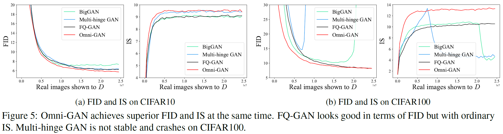

## Omni-GAN

This repository contains code for the paper, [Omni-GAN: On the Secrets of cGANs and Beyond](https://arxiv.org/abs/2011.13074).

### TODO

⬜️ Release training code for ImageNet experiments  
✔️ DGP experiments with pretrained Omni-INR-GAN models  
✔️ Resutls on ImageNet 256x256 dataset  
✔️ Results on ImageNet 128x128 dataset  


===========================================================
### Updates

#### **2021-03-30**: Omni-INR-GAN

We invented Omni-INR-GAN, which is more friendly to GAN inversion tasks. Please see our paper [Omni-GAN: On the Secrets of cGANs and Beyond](https://arxiv.org/abs/2011.13074).

<p float="left">

</p>

- Colorization

[https://www.bilibili.com/video/BV1nZ4y1A7H8?share_source=copy_web](https://www.bilibili.com/video/BV1nZ4y1A7H8?share_source=copy_web)

- Generating images of arbitrary resolution

[https://www.bilibili.com/video/BV1SZ4y1w7gu?share_source=copy_web](https://www.bilibili.com/video/BV1SZ4y1w7gu?share_source=copy_web)

- Super-resolution x60+

[https://www.bilibili.com/video/BV1Rh411S7Eg?share_source=copy_web](https://www.bilibili.com/video/BV1Rh411S7Eg?share_source=copy_web)

#### **2021-02-17**: Results on ImageNet (256x256 resolution)

The ImageNet 256x256 experiment requires much longer training time. For example, it took about thirty days to train the BigGAN using eight v100 GPUs, and then the BigGAN began to collapse. Omni-GAN enjoys faster convergence and superior performance than BigGAN in terms of both IS and FID. To see if the Omni-GAN will collapse, we trained Omni-GAN for more epochs and no mode collapse is observed.

<p float="left">


</p>

#### **2020-12-23**: Results on ImageNet (128x128 resolution)

Since I recently acquired GPU resources, I trained Omni-GAN on ImageNet datasets (with 128x128 resolution). Omni-GAN only needs one day to reach the IS score of BigGAN which is trained for two weeks!  Experiments were conducted on 8xV100 (32GB VRAM each). Below are the IS and FID curves. We will release the trained models to benefit the research of the community.

<p float="left">


</p>

===========================================================

### Comparision of several cGANs


#### Results on CIFAR100
<p float="left">


</p>

#### More results


## Let's go!

### Environments


```bash
git clone --recursive https://github.com/PeterouZh/Omni-GAN-PyTorch.git
cd Omni-GAN-PyTorch
conda create -y --name omnigan python=3.6.7 
conda activate omnigan
pip install torch==1.6.0+cu101 torchvision==0.7.0+cu101 -f https://download.pytorch.org/whl/torch_stable.html
python -m pip install detectron2 -f https://dl.fbaipublicfiles.com/detectron2/wheels/cu101/torch1.6/index.html
pip install -r requirements.txt
```
- cuda 10.0
- cudnn 7.6.5

Cuda and cudnn are needed by the TensorFlow which is only utilized for the sake of evaluation (monitoring the training process). We recommend downloading cuda and cudnn from the official website and installing them manually.

### Prepare FID statistics files

We provide the FID statistics files calculated on CIFAR10 and CIFAR100 at [OneDrive](https://sjtueducn-my.sharepoint.com/:f:/g/personal/zhoupengcv_sjtu_edu_cn/Ek0QSX1UhylDjVYdmXYxRtcBMLs54AYD4E3CwZlWBXZmPA?e=BzWa9D) respectively. Download them and put them into the `datasets` dir. 
Of course, you can calculate these files by yourself. Below is the command. 


- CIFAR10
```bash
export LD_LIBRARY_PATH=$HOME/.keras/envs/cuda-10.0/lib64:$HOME/.keras/envs/cudnn-10.0-linux-x64-v7.6.5.32/lib64
export CUDA_VISIBLE_DEVICES=0
export PYTHONPATH=./
python template_lib/v2/GAN/evaluation/tf_FID_IS_score.py \
  --tl_config_file configs/prepare_files.yaml \
  --tl_command calculate_fid_stat_CIFAR \
  --tl_outdir results/calculate_fid_stat_CIFAR10 \
  --tl_opts dataset_name cifar10_train \
            dataset_mapper_cfg.name CIFAR10DatasetMapper \
            GAN_metric.tf_fid_stat datasets/fid_stats_tf_cifar10_train_32.npz \
            GAN_metric.tf_inception_model_dir datasets/tf_inception_model
```

- CIFAR100
```bash
export LD_LIBRARY_PATH=$HOME/.keras/envs/cuda-10.0/lib64:$HOME/.keras/envs/cudnn-10.0-linux-x64-v7.6.5.32/lib64
export CUDA_VISIBLE_DEVICES=0
export PYTHONPATH=./
python template_lib/v2/GAN/evaluation/tf_FID_IS_score.py \
  --tl_config_file configs/prepare_files.yaml \
  --tl_command calculate_fid_stat_CIFAR \
  --tl_outdir results/calculate_fid_stat_CIFAR100 \
  --tl_opts dataset_name cifar100_train \
            dataset_mapper_cfg.name CIFAR100DatasetMapper \
            GAN_metric.tf_fid_stat datasets/fid_stats_tf_cifar100_train_32.npz \
            GAN_metric.tf_inception_model_dir datasets/tf_inception_model
```


## Evaluation

We provide trained models on CIFAR10 and CIFAR100 at [OneDrive](https://sjtueducn-my.sharepoint.com/:f:/g/personal/zhoupengcv_sjtu_edu_cn/Ek0QSX1UhylDjVYdmXYxRtcBMLs54AYD4E3CwZlWBXZmPA?e=BzWa9D). Download them and put them in `datasets` dir.

### CIFAR10
```bash
export CUDA_VISIBLE_DEVICES=0
export PYTHONPATH=./:./BigGAN_PyTorch_1_lib 
export LD_LIBRARY_PATH=$HOME/.keras/envs/cuda-10.0/lib64:$HOME/.keras/envs/cudnn-10.0-linux-x64-v7.6.5.32/lib64 
python exp/omni_loss/train.py \
  --tl_config_file configs/omni_gan_cifar10.yaml \
  --tl_command eval_trained_model \
  --tl_opts eval_cfg.path datasets/G_ema_best_FID_cifar10.pth \
            GAN_metric.tf_fid_stat datasets/fid_stats_tf_cifar10_train_32.npz \
  --tl_outdir results/eval_trained_model_cifar10
```

```bash
export CUDA_VISIBLE_DEVICES=0
export PYTHONPATH=./:./BigGAN_PyTorch_1_lib 
export LD_LIBRARY_PATH=$HOME/.keras/envs/cuda-10.0/lib64:$HOME/.keras/envs/cudnn-10.0-linux-x64-v7.6.5.32/lib64 
python exp/omni_loss/train.py \
  --tl_config_file configs/omni_gan_cifar10.yaml \
  --tl_command eval_trained_model \
  --tl_opts eval_cfg.path datasets/G_ema_best_IS_cifar10.pth \
            GAN_metric.tf_fid_stat datasets/fid_stats_tf_cifar10_train_32.npz \
  --tl_outdir results/eval_trained_model_cifar10
```

### CIFAR100
```bash
export CUDA_VISIBLE_DEVICES=0
export PYTHONPATH=./:./BigGAN_PyTorch_1_lib 
export LD_LIBRARY_PATH=$HOME/.keras/envs/cuda-10.0/lib64:$HOME/.keras/envs/cudnn-10.0-linux-x64-v7.6.5.32/lib64 
python exp/omni_loss/train.py \
  --tl_config_file configs/omni_gan_cifar100.yaml \
  --tl_command eval_trained_model \
  --tl_opts eval_cfg.path datasets/G_ema_best_FID_cifar100.pth \
            GAN_metric.tf_fid_stat datasets/fid_stats_tf_cifar100_train_32.npz \
  --tl_outdir results/eval_trained_model_cifar100 
```

## Train Omni-GAN

### CIFAR10
```bash
export CUDA_VISIBLE_DEVICES=0
export PYTHONPATH=./:./BigGAN_PyTorch_1_lib 
export LD_LIBRARY_PATH=$HOME/.keras/envs/cuda-10.0/lib64:$HOME/.keras/envs/cudnn-10.0-linux-x64-v7.6.5.32/lib64 
python exp/omni_loss/train.py \
  --tl_config_file configs/omni_gan_cifar10.yaml \
  --tl_command train_Omni_GAN \
  --tl_outdir results/train_Omni_GAN_cifar10 \
  --tl_opts GAN_metric.tf_fid_stat datasets/fid_stats_tf_cifar10_train_32.npz \
            GAN_metric.tf_inception_model_dir datasets/tf_inception_model \
            args.data_root datasets/cifar10

```
The metrics are saved in `results/train_Omni_GAN_cifar10/textdir`.

### CIFAR100
```bash
export CUDA_VISIBLE_DEVICES=0
export PYTHONPATH=./:./BigGAN_PyTorch_1_lib 
export LD_LIBRARY_PATH=$HOME/.keras/envs/cuda-10.0/lib64:$HOME/.keras/envs/cudnn-10.0-linux-x64-v7.6.5.32/lib64 
python exp/omni_loss/train.py \
  --tl_config_file configs/omni_gan_cifar100.yaml \
  --tl_command train_Omni_GAN \
  --tl_opts GAN_metric.tf_fid_stat datasets/fid_stats_tf_cifar100_train_32.npz \
            GAN_metric.tf_inception_model_dir datasets/tf_inception_model \
            args.data_root datasets/cifar100 \
  --tl_outdir results/train_Omni_GAN_cifar100
```
The metrics are saved in `results/train_Omni_GAN_cifar100/textdir`.

## Train BigGAN

### CIFAR10
```bash
export CUDA_VISIBLE_DEVICES=0
export PYTHONPATH=./exp:./:./BigGAN_PyTorch_1_lib
export LD_LIBRARY_PATH=$HOME/.keras/envs/cuda-10.0/lib64:$HOME/.keras/envs/cudnn-10.0-linux-x64-v7.6.5.32/lib64 
python BigGAN_PyTorch_1_lib/train.py \
  --tl_config_file configs/biggan_cifar.yaml \
  --tl_command train_BigGAN_c10 \
  --tl_outdir results/train_BigGAN_cifar10 \
  --tl_opts GAN_metric.tf_fid_stat datasets/fid_stats_tf_cifar10_train_32.npz \
            GAN_metric.tf_inception_model_dir datasets/tf_inception_model \
            args.data_root datasets/cifar10
```

### CIFAR100
```bash
export CUDA_VISIBLE_DEVICES=0
export PYTHONPATH=./exp:./:./BigGAN_PyTorch_1_lib
export LD_LIBRARY_PATH=$HOME/.keras/envs/cuda-10.0/lib64:$HOME/.keras/envs/cudnn-10.0-linux-x64-v7.6.5.32/lib64 
python BigGAN_PyTorch_1_lib/train.py \
  --tl_config_file configs/biggan_cifar.yaml \
  --tl_command train_BigGAN_c100 \
  --tl_outdir results/train_BigGAN_cifar100 \
  --tl_opts GAN_metric.tf_fid_stat datasets/fid_stats_tf_cifar100_train_32.npz \
            GAN_metric.tf_inception_model_dir datasets/tf_inception_model \
            args.data_root datasets/cifar100
```

## Acknowledgments

- BigGAN implemented from [https://github.com/ajbrock/BigGAN-PyTorch](https://github.com/ajbrock/BigGAN-PyTorch).
- Multi-label classification loss derived by [Jianlin Su](https://kexue.fm/archives/7359).
- Detectron2 library [https://github.com/facebookresearch/detectron2](https://github.com/facebookresearch/detectron2).


